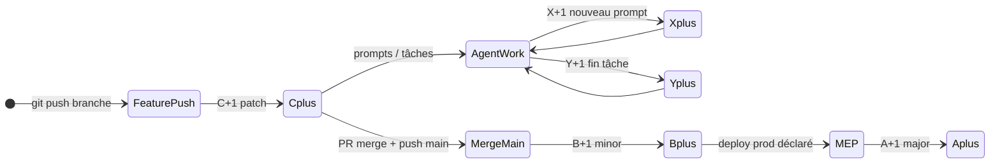

# 08 — Versionnement global (A.B.C.X.Y)

Updated: 2026-07-01  
**Source de vérité** pour le schéma complet release + dev. Complète [`05-politique-versionnement.md`](./05-politique-versionnement.md) (X/Y, DEV_LOG, hooks Cursor).

---

## Label affiché

```
v{A}.{B}.{C}.{X}
v{A}.{B}.{C}.{X}.{Y}    (si Y > 0)
```

**Exemple :** `v2.2.0.04.1` = release `2.2.0` + prompt X=4 + tâche Y=1.

---

## Deux vitesses

| Couche | Segments | Granularité | Mécanisme |
|--------|----------|-------------|-----------|
| **Release / livraison** | **A · B · C** | Git, MEP, pushes | Git hook `pre-push` + scripts npm |
| **Dev / session agent** | **X · Y** | Prompts, tâches | Hooks Cursor (`beforeSubmitPrompt`, `stop`) |

Stockage :

| Segment | Fichier | Champ |
|---------|---------|-------|
| A, B, C | `package.json` | `version` (`major.minor.patch`) |
| X, Y | `build-revision.json` | `revision`, `subRevision` |

---

## Sémantique A · B · C (définition projet)

| Seg. | Nom | Quand ça bouge | Exemple |
|------|-----|----------------|---------|
| **A** | **MEP** | Mise en **PROD** : push final, appli déployée, MEP déclarée | `2.2.0` → `3.0.0` |
| **B** | **Push main** | Chaque `git push` vers `main` | `2.2.0` → `2.3.0` |
| **C** | **Push branche** | Chaque `git push` sur branche de travail (`feature/*`, etc.) | `2.2.0` → `2.2.1` |

### Clôture de branche (rituel agent — pas à chaque push C)

Le hook **C** compte chaque push ; la **mise au propre** se fait quand la branche est **terminée** (avant merge).

| # | Action | Références |
|---|--------|------------|
| 1 | **DEV_LOG** — recap Y, compléter section X, Historique si prompt fermé | [`05-politique-versionnement.md`](./05-politique-versionnement.md) |
| 2 | **Validation** — `build` ; `validate:*` si bonds/corpus ; `tnr:baseline` si assets | [`06-pipeline-validation.md`](./06-pipeline-validation.md) |
| 3 | **Docs** — `project-state.md`, changelog, [`04-fichiers-par-commit.md`](./04-fichiers-par-commit.md) | |
| 4 | **Normalisation** — `REFERENCES.md`, `DOC_AGENT_INDEX.md` si chemins/nouveaux docs | |
| 5 | **Nettoyage** — `git mv` / `mv` → dossier **gitignoré** (`old_v2.1/`, `old_assets/`, `archive/`) — **jamais supprimer** ; purge manuelle user (local ou autre DD) ; manifeste | [`CLEANUP_2_2_RESIDUAL_MANIFEST.md`](../CLEANUP_2_2_RESIDUAL_MANIFEST.md) |
| 6 | **Pipelines** — nouveaux scripts `validate:*` / npm si process répétable | |
| 7 | **Commits atomiques** — 1 Y ≈ 1 commit | DEV_LOG |
| 8 | **Push branche** → **C+1** auto | `release-events.jsonl` |

### Push main (B) — rituel agent

**B** bump auto au `git push main`. **Go explicite Guillaume obligatoire** avant tout push `main`.

| # | Action |
|---|--------|
| 1 | Confirmer autorisation push / merge `main` |
| 2 | Release gate (validate + build, TNR si baseline) |
| 3 | `VERSION-INDEX.md` + `project-state.md` |
| 4 | DEV_LOG sections complétées pour ce qui merge |
| 5 | Push → **B+1** auto |

**B ≠ MEP** — push `main` sans deploy prod ne déclenche **pas** A.

### Kickoff phase suivante

Souvent **après** clôture branche ou merge `main`, quand une **nouvelle phase** démarre — pas à chaque C.

Procédure complète : [`07-kickoff-nouvelle-version.md`](./07-kickoff-nouvelle-version.md) — proposer dès le 1er message si signaux kickoff non fait.

### MEP (A) — procédure agent (jamais 100 % auto)

#### Comportement agent

1. **Proposer** explicitement : « Procédure MEP complète (A) ? » + checklist ci-dessous.
2. **Interdit** : `npm run version:mep` sans accord explicite Guillaume.
3. Si oui → `--dry-run` → montrer semver → **go** → bump A.
4. Enchaîner doc, tag, rappel deploy (deploy = Guillaume).

#### Checklist MEP (A)

| # | Action |
|---|--------|
| 1 | `npm run version:mep -- --dry-run` puis `version:mep` |
| 2 | [`VERSION-INDEX.md`](../traceability/changelog/VERSION-INDEX.md) — jalon A |
| 3 | Tag git (si demandé) |
| 4 | Deploy appli prod (Guillaume — `deploy/` local) |
| 5 | DEV_LOG + `project-state.md` — clôture phase |
| 6 | Smoke UI si écrans/assets ([`06-pipeline-validation.md`](./06-pipeline-validation.md)) |
| 7 | `release-events.jsonl` (auto au bump) |

```bash
npm run version:mep -- --dry-run   # prépare
npm run version:mep                  # après go humain uniquement
```

---

## Sémantique X · Y (session dev)

| Seg. | Quand | Mécanisme |
|------|-------|-----------|
| **X** | Nouveau **message user** | Hook `A.B.C.X.Y - X update - prompt indent.mjs` |
| **Y** | **Tâche distincte** dans le prompt (fichiers modifiés) | Hook `A.B.C.X.Y - Y update - subprompt indent.mjs` |

Opt-out : `même X` / `même Y` dans le message.

Détail : [`05-politique-versionnement.md`](./05-politique-versionnement.md), [`.cursor/hooks/README.md`](../../.cursor/hooks/README.md).

---

## Machine à états



| Événement | Segment | Commande |
|-----------|---------|----------|
| Push branche feature | **C** | auto `pre-push` → `version:branch-push` |
| Push `main` | **B** | auto `pre-push` → `version:main-push` |
| MEP | **A** | manuel `version:mep` |
| Nouveau prompt user | **X** | hook Cursor |
| Tâche agent | **Y** | hook Cursor `stop` |

Journal release : [`release-events.jsonl`](../traceability/changelog/release-events.jsonl)  
Index jalons : [`VERSION-INDEX.md`](../traceability/changelog/VERSION-INDEX.md)

---

## Implémentation

### Git hooks (A/B/C)

```bash
npm run hooks:install
```

Configure `core.hooksPath=.githooks`. Le hook `pre-push` appelle :

- branche `main` / `master` → `npm run version:main-push` (**B**)
- autre branche → `npm run version:branch-push` (**C**)

Ne bloque **pas** le push (exit 0).

| Script | Rôle |
|--------|------|
| [`scripts/bump-branch-push.mjs`](../../scripts/bump-branch-push.mjs) | C+1 |
| [`scripts/bump-main-push.mjs`](../../scripts/bump-main-push.mjs) | B+1 |
| [`scripts/bump-mep.mjs`](../../scripts/bump-mep.mjs) | A+1 |
| [`scripts/git-hooks/on-pre-push.mjs`](../../scripts/git-hooks/on-pre-push.mjs) | Routeur git |
| [`scripts/lib/release-version.mjs`](../../scripts/lib/release-version.mjs) | Semver A.B.C |

### Hooks Cursor (X/Y)

| Fichier | Rôle |
|---------|------|
| [`.cursor/hooks.json`](../../.cursor/hooks.json) | Config |
| `A.B.C.X.Y - X update - prompt indent.mjs` | X |
| `A.B.C.X.Y - Y update - subprompt indent.mjs` | Y |

Output JSON : `executionLogLabel` = `{projet} · v{A}.{B}.{C}.{X}.{Y} · release A.B.C={semver} · bump X|Y`.

---

## CI garde-fou (cible)

| Gate | Vérification |
|------|--------------|
| PR feature | Label UI cohérent avec dernier **C** |
| Merge main | **B** bumpé dans `package.json` |
| Tag MEP | **A** documenté dans `VERSION-INDEX.md` |

*(Workflow CI à brancher quand le repo GitHub aura les checks — règles documentées ici.)*

---

## Compteurs qui montent vite ?

Pour une appli **perso**, ce n’est **pas un problème** : A/B/C/X/Y sont des **compteurs d’événements**, pas un semver marketing.

Le « point de vigilance » ne s’applique que si tu voulais un numéro **stable** pour communication externe — auquel cas le **tag MEP (A)** sert de jalon public, le reste reste interne.

---

## Anti-patterns

| ❌ | ✅ |
|----|-----|
| MEP auto sans humain | `version:mep --dry-run` puis validation |
| Bump A/B/C via hook Cursor prompt | Git hook + scripts npm |
| Confondre tag Git et label UI | Tag = jalon ; UI = A.B.C.X.Y |
| Deux agents writers même repo | Un writer à la fois |
| Oublier `hooks:install` sur clone | `npm run hooks:install` |

---

## Annexe — User Rules (copier-coller global)

Bloc pour **Cursor → Settings → Rules → User Rules** (tous projets) :

```markdown
# Versionnement A.B.C.X.Y — tous projets

Format UI : v{A}.{B}.{C}.{X}.{Y}
Release = package.json (A.B.C) · Dev = build-revision.json (X.Y)

## Segments
- A = MEP prod (manuel, jamais auto)
- B = chaque push main (git pre-push auto)
- C = chaque push branche feature (git pre-push auto)
- X = nouveau prompt user (hook Cursor)
- Y = tâche agent si fichiers modifiés (hook stop)
- Opt-out : même X / même Y

## Install
- Git hooks : npm run hooks:install (une fois par clone)
- Cursor hooks : .cursor/hooks.json — workspace trusted, redémarrer Cursor

## C — push branche (agent)
Avant push : build, DEV_LOG/Y, docs, normalisation (REFERENCES, index doc).
Clôture branche (pas chaque C) : validation (validate/build/TNR), move vers gitignore (jamais supprimer), pipelines, commits atomiques, puis push → C auto.

## B — push main (agent)
Jamais push main sans go explicite du décideur.
Avant push : release gate, VERSION-INDEX, project-state, DEV_LOG complété → push → B auto.
B ≠ MEP.

## A — MEP (agent)
Proposer « procédure MEP complète ? » + checklist — ne jamais version:mep sans accord.
Ordre : --dry-run → go humain → version:mep → VERSION-INDEX → tag → deploy (humain) → DEV_LOG recap.

## Kickoff nouvelle phase
Proposer avant de coder si phase non initialisée : branche feature/N, semver N.0.0, reset build-revision, DEV_LOG phase, hooks:install, build.

## Rappels
- Multi-projets : executionLogLabel / projectRoot dans Output Hooks
- Un seul writer agent par repo
- **Jamais supprimer** — move vers **gitignore** uniquement ; purge manuelle user (local ou autre DD)
- Processus partagés : C:\Dev\Project\REFERENCE\docs\INDEX.md
```

---

## Liens

| Doc | Contenu |
|-----|---------|
| [05-politique-versionnement.md](./05-politique-versionnement.md) | X/Y, DEV_LOG, commits atomiques |
| [07-kickoff-nouvelle-version.md](./07-kickoff-nouvelle-version.md) | Démarrage nouvelle phase |
| [06-pipeline-validation.md](./06-pipeline-validation.md) | Validate / TNR |
| [`.cursor/hooks/README.md`](../../.cursor/hooks/README.md) | Debug hooks Cursor |
